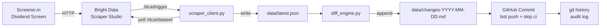

# Screener Self-Heal — Into the Scrape-Verse Hackathon

Automated dividend yield data pipeline powered by **Bright Data Scraper Studio**, with built-in self-healing demonstration.

---

## Overview

This project automates the full data lifecycle for tracking high-dividend-yield stocks on [Screener.in](https://www.screener.in):

1. **Scrape** — Trigger a Bright Data Scraper Studio collector run and download structured JSON results
2. **Diff** — Compare fresh results against the previous snapshot; surface meaningful changes (new entries, exits, yield threshold crossings)
3. **Commit** — GitHub Actions commits `data/latest.json` and the change report back to `main`, turning git history into a timestamped audit log
4. **Self-Heal** — A deliberate mirror page with an altered DOM layout demonstrates Scraper Studio's self-healing / re-prompt capability

---

## Architecture



---

## Quickstart

```bash
cp .env.example .env        # add BRIGHT_DATA_API_TOKEN and BRIGHT_DATA_COLLECTOR_ID
pip install -r requirements.txt

python src/run_scrape.py    # trigger → poll → download → data/latest.json
python src/run_diff.py      # diff vs previous → data/changes-YYYY-MM-DD.md
```

---

## Docs

- [Setup & Configuration](docs/setup.md) — prerequisites, env vars, GitHub secrets, component reference
- [GitHub Actions Automation](docs/automation.md) — workflow details and `[skip ci]` behaviour
- [Self-Healing Demo](docs/self-heal-demo.md) — step-by-step demo walkthrough
- [Output Schema Reference](docs/schema.md) — record fields, envelope format, diff thresholds

---

## Future Work

- **NSE/BSE corporate announcements** — Pull data from NSE/BSE XBRL filings to detect dividend declarations before the screen reflects the change.
- **Scheduled scrapes** — Add a cron-triggered workflow to run daily at market close.
- **Slack / email alerts** — Pipe the change report to a notification channel.

---

## AI-Assistance Disclosure

This project was built with AI assistance (Claude) for code generation, spec drafting, and GitHub Actions configuration. All code has been reviewed and is understood by the author. The Bright Data Scraper Studio collector selectors were built manually in the Scraper Studio UI. The self-healing mechanism is a native Scraper Studio feature — the AI's role was scaffolding the surrounding pipeline, not the core scraping logic.
