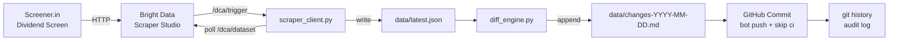

# Screener Self-Heal — Into the Scrape-Verse Hackathon

**Hitesh Pattanayak** · Senior Product Engineer · Improving

Automated dividend yield data pipeline powered by **Bright Data Scraper Studio**, with built-in self-healing demonstration.

---

## Overview

This project automates the full data lifecycle for tracking high-dividend-yield stocks on [Screener.in](https://www.screener.in):

1. **Scrape** — Trigger a Bright Data Scraper Studio collector run and download structured JSON results
2. **Diff** — Compare fresh results against the previous snapshot; surface meaningful changes (new entries, exits, yield threshold crossings)
3. **Commit** — GitHub Actions commits `data/latest.json` and the change report back to `main`, turning git history into a timestamped audit log
4. **Self-Heal** — A deliberate mirror page with an altered DOM layout demonstrates Scraper Studio's self-healing / re-prompt capability

---

## Architecture



---

## Quickstart

```bash
cp .env.example .env        # add BRIGHT_DATA_API_TOKEN and BRIGHT_DATA_COLLECTOR_ID
pip install -r requirements.txt

python src/run_scrape.py    # trigger → poll → download → data/latest.json
python src/run_diff.py      # diff vs previous → data/changes-YYYY-MM-DD.md
```

---

## Docs

- [Setup & Configuration](docs/setup.md) — prerequisites, env vars, GitHub secrets, component reference
- [GitHub Actions Automation](docs/automation.md) — workflow details and `[skip ci]` behaviour
- [Self-Healing Demo](docs/self-heal-demo.md) — step-by-step demo walkthrough
- [Output Schema Reference](docs/schema.md) — record fields, envelope format, diff thresholds

---

## Self-Healing Demo

The demo uses a static mirror page hosted on GitHub Pages that deliberately alternates between two structurally different HTML layouts on every run — simulating a real-world DOM change without needing to touch Screener.in.

### Why a Demo Mirror?

Triggering a real DOM change on Screener.in is not possible — it's a live third-party site. To demonstrate self-healing in a controlled, repeatable way, we mirror the page structure locally and use a GitHub Actions workflow (`break-mirror.yml`) to swap the layout on demand. This lets us:

- Break and heal the scraper as many times as needed without depending on an external site changing
- Keep the demo fully automated and reproducible in CI
- Isolate the self-healing logic from unrelated production scrape noise

### PROD vs DEMO Layout Diff

| | PROD (Screener.in) | DEMO Mirror (GitHub Pages) |
|---|---|---|
| Target URL | `https://www.screener.in/screens/...` | `https://hiteshrepo.github.io/screener-selfheal/demo/mirror/index.html` |
| Collector | Production collector | Separate demo collector |
| Layout alternation | Stable | Swaps v1 ↔ v2 on every `break-mirror.yml` run |

### v1 vs v2 Structural Diff (what breaks the scraper)

| | v1 (Layout A) | v2 (Layout B) |
|---|---|---|
| Table class | `table.data-table` | `table.screener-table` |
| Container | `<div id="result">` | `<section id="screen-output"><div class="screener-wrapper">` |
| `<thead>` | bare | `<thead class="table-header">` |
| `<tbody>` | bare | `<tbody class="mirror-rows">` |
| Col 6 | Dividend Yield | ROCE % |
| Col 7 | ROCE % | ROE % |
| Col 8 | ROE % | Div. Yield (%) |

Both layouts look visually identical to a human — the differences are structural HTML only.

### How the Self-Heal Loop Works

When `index.html` switches layout, the demo collector's selectors find nothing (`record_count: 0`). The self-heal loop (`src/run_selfheal.py`) then:

1. **Detects** the broken scrape (0 records returned)
2. **Parses** the live `index.html` with BeautifulSoup to dynamically discover the new table class, tbody class, and column headers
3. **Builds** a targeted prompt describing exactly which selectors to change and the correct column order
4. **Sends** the prompt to Bright Data's `refactor_template` API
5. **Validates** the generated code via `preview_result` — refuses to save if preview returns 0 records
6. **Approves** and saves the new parser version

The demo is fully repeatable: `break-mirror.yml` alternates the layout on every run, so no manual Bright Data reset is needed.

---

## Future Work

- **NSE/BSE corporate announcements** — Pull data from NSE/BSE XBRL filings to detect dividend declarations before the screen reflects the change.
- **Scheduled scrapes** — Add a cron-triggered workflow to run daily at market close.
- **Slack / email alerts** — Pipe the change report to a notification channel.

---

## AI-Assistance Disclosure

This project was built with AI assistance (Claude) for code generation, spec drafting, and GitHub Actions configuration. All code has been reviewed and is understood by the author. The Bright Data Scraper Studio collector selectors were built manually in the Scraper Studio UI. The self-healing mechanism is a native Scraper Studio feature — the AI's role was scaffolding the surrounding pipeline, not the core scraping logic.
