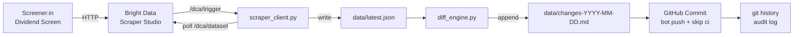

# Screener Self-Heal — Into the Scrape-Verse Hackathon

Automated dividend yield data pipeline powered by **Bright Data Scraper Studio**, with built-in self-healing demonstration.

---

## Overview

This project automates the full data lifecycle for tracking high-dividend-yield stocks on [Screener.in](https://www.screener.in):

1. **Scrape** — Trigger a Bright Data Scraper Studio collector run and download structured JSON results
2. **Diff** — Compare fresh results against the previous snapshot; surface meaningful changes (new entries, exits, yield threshold crossings)
3. **Commit** — GitHub Actions commits `data/latest.json` and the change report back to `main`, turning git history into a timestamped audit log
4. **Self-Heal** — A deliberate mirror page with an altered DOM layout demonstrates Scraper Studio's self-healing / re-prompt capability

---

## Architecture



**Component summary:**

| File | Role |
|---|---|
| `src/scraper_client.py` | `BrightDataClient` — trigger, poll, download, rotate snapshots |
| `src/run_scrape.py` | CLI entry point: wires trigger → poll → download |
| `src/diff_engine.py` | `DiffEngine` — loads snapshots, classifies changes, writes report |
| `src/run_diff.py` | CLI entry point: runs diff against default paths |
| `src/schema.py` | `validate_record()` — JSON Schema (Draft 7) validation helper |
| `data/schema.json` | Machine-readable canonical record schema |
| `data/sample.json` | Example records conforming to the schema |
| `.github/workflows/scrape-on-merge.yml` | Auto-scrape on push to `main`, commit results |
| `.github/workflows/selfheal-demo.yml` | Manual-dispatch demo run against the mirror page |
| `demo/mirror/index.html` | Static mirror with altered DOM layout for self-heal demo |

---

## Setup & Configuration

### Prerequisites

- Python 3.10+
- A Bright Data account with a Scraper Studio collector for the Screener.in dividend screen

### Environment Variables

Copy `.env.example` and fill in your credentials:

```bash
cp .env.example .env
```

| Variable | Required | Description |
|---|---|---|
| `BRIGHT_DATA_API_TOKEN` | Yes | Bright Data API bearer token |
| `BRIGHT_DATA_COLLECTOR_ID` | Yes | Scraper Studio collector ID (e.g. `c_msvhzc3s2gixuk6k42`) |

### Install Dependencies

```bash
pip install -r requirements.txt
```

### GitHub Repository Secrets

Add the following secrets in **Settings → Secrets and variables → Actions**:

| Secret | Value |
|---|---|
| `BRIGHT_DATA_API_TOKEN` | Your Bright Data API token |
| `BRIGHT_DATA_COLLECTOR_ID` | Your collector ID |

---

## Running Locally

### Run the full scrape + diff pipeline

```bash
# Scrape: trigger collector, poll until ready, download results
python src/run_scrape.py

# Diff: compare latest vs previous snapshot, write change report
python src/run_diff.py
```

Output files:

- `data/latest.json` — current scrape (envelope with `meta` + `records`)
- `data/previous.json` — prior scrape (rotated automatically before each new download)
- `data/changes-YYYY-MM-DD.md` — appended change report for today

### Run schema validation manually

```python
from src.schema import validate_record
validate_record({"company_name": "Infosys", "ticker": "INFY", ...})
```

---

## GitHub Actions Automation

### `scrape-on-merge.yml`

Triggers on every push to `main`.

1. Checks out the repo
2. Installs dependencies
3. Runs `python src/run_scrape.py`
4. Runs `python src/run_diff.py`
5. Commits `data/latest.json` + today's change report back to `main` with message `[skip ci] scrape results <timestamp>`

The `[skip ci]` tag prevents the bot commit from re-triggering the workflow (GitHub natively skips workflows for commits containing `[skip ci]` when using the default `GITHUB_TOKEN`).

### `selfheal-demo.yml`

Manual-dispatch only (`workflow_dispatch`).

Points the collector at the GitHub Pages mirror URL:
```
https://hiteshrepo.github.io/screener-selfheal/demo/mirror/index.html
```

Writes results to `data/demo-latest.json`. Used to demonstrate the self-healing scenario described below.

---

## Self-Healing Demo

The demo shows Scraper Studio recovering when the target page layout changes unexpectedly.

### Setup

Enable GitHub Pages: **Settings → Pages → Source: `main` branch, `/ (root)`**

The mirror will be live at:
```
https://hiteshrepo.github.io/screener-selfheal/demo/mirror/index.html
```

### Step-by-step

**Step 1 — Observe the failure**

The mirror page (`demo/mirror/index.html`) has deliberate layout alterations:
- Column header `"Dividend Yield"` renamed to `"Div. Yield (%)"`
- Table wrapped in an extra `<div class="data-wrapper">` layer
- CSS class `screener-table` renamed to `alt-table`

When the original collector selectors are applied to the mirror, the extraction is empty or malformed. This is documented in `demo/README.md`.

**Step 2 — Run the demo workflow**

```bash
# Trigger via GitHub UI: Actions → Self-Healing Demo → Run workflow
# OR via CLI:
gh workflow run selfheal-demo.yml
```

Observe `data/demo-latest.json` — it will be empty or contain malformed records, demonstrating the layout mismatch.

**Step 3 — Trigger Scraper Studio self-healing**

In the Bright Data Scraper Studio UI:
1. Open the collector
2. Point it at the mirror URL
3. Use the re-prompt / self-healing flow to regenerate selectors
4. Run again

Observe `data/demo-latest.json` — the collector now correctly extracts the sample rows.

**Step 4 — Compare before/after**

The before state is captured at `data/demo-before.json` (written at the start of the demo workflow before recovery). Use `python src/run_diff.py` with the demo paths to produce a change report.

---

## Output Schema Reference

Each scraped record conforms to `data/schema.json` (JSON Schema Draft 7).

**Required fields:**

| Field | Type | Description |
|---|---|---|
| `company_name` | string | Full company name as on Screener.in |
| `ticker` | string | NSE/BSE ticker symbol (e.g. `"INFY"`) |
| `exchange` | string | `"NSE"` or `"BSE"` |
| `cmp` | number | Current market price (INR) |
| `dividend_yield_pct` | number | Dividend yield as a percentage (e.g. `3.5` for 3.5%) |
| `scraped_at` | string | ISO 8601 UTC timestamp |
| `source_url` | string | Full URL of the scraped screen |

**Optional fields (present when available):**

| Field | Type | Description |
|---|---|---|
| `pe_ratio` | number \| null | Price-to-earnings ratio |
| `market_cap_cr` | number \| null | Market cap in crores INR |
| `roce_pct` | number \| null | Return on capital employed (%) |
| `roe_pct` | number \| null | Return on equity (%) |
| `sales_growth_pct` | number \| null | Sales growth (%) |

**Dataset envelope** (`data/latest.json`):

```json
{
  "meta": {
    "scraped_at": "2024-06-15T10:30:00Z",
    "source_url": "https://www.screener.in/screens/...",
    "collector_id": "c_msvhzc3s2gixuk6k42",
    "record_count": 25
  },
  "records": [ /* array of canonical records */ ]
}
```

**Diff engine thresholds (defaults):**

| Threshold | Default | Meaning |
|---|---|---|
| `yield_change_pp` | `0.5` | Minimum yield change (percentage points) to flag as CHANGED |

Classifications: `ENTERED` (new ticker), `EXITED` (ticker dropped off screen), `CHANGED` (yield moved past threshold), `UNCHANGED`.

---

## Future Work

- **NSE/BSE corporate announcements** — The dividend change detection in this project is scraping-based. A natural extension would be to pull data directly from NSE/BSE corporate announcement feeds (XBRL filings, announcements API). This would give dividend declarations at the source, before the screen reflects the change — turning a reactive tracker into a proactive one.
- **Scheduled scrapes** — Add a cron-triggered workflow to run daily at market close rather than only on push to `main`.
- **Slack / email alerts** — Pipe the change report to a notification channel so changes surface without checking git.

---

## AI-Assistance Disclosure

This project was built with AI assistance (Claude) for code generation, spec drafting, and GitHub Actions configuration. All code has been reviewed and is understood by the author. The Bright Data Scraper Studio collector selectors were built manually in the Scraper Studio UI. The self-healing mechanism is a native Scraper Studio feature — the AI's role was scaffolding the surrounding pipeline, not the core scraping logic.
